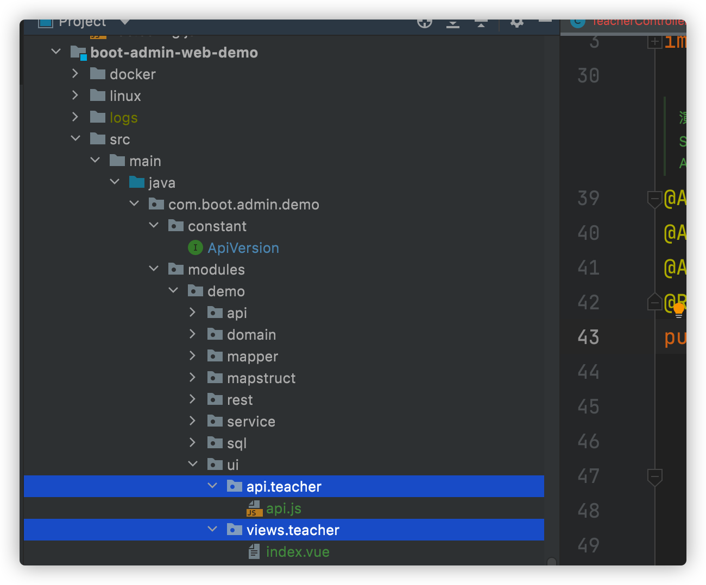
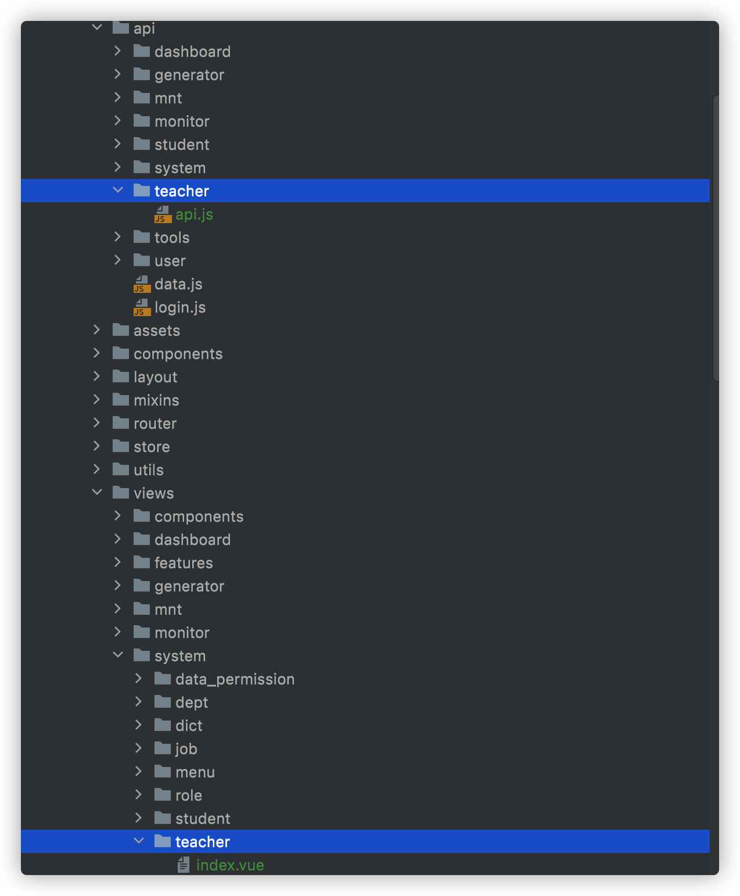

# 代码生成
> 这里拿student表做生成示例
1. 在数据库管理工具中将**student**表复制并重命名为**teacher**

2. 点击配置

   

3. 配置接口信息

   

4. 配置字段，生成

   

5. 代码生成完成

   

6. 前端代码配置

   > 移动teacher/api.js到boot-admin-ui/src/api下，移动teacher/index.vue到boot-admin-ui/src/views/system/下

   

   

7. 手动执行sql/TeacherMenuRoleSql.sql（回滚sql已注释），添加菜单、权限赋予超级管理员角色（一般这段sql会由liquibase自动执行）

8. 重启后端boot-admin-web-demo，刷新缓存方法，任选一种

   - 用户**退出再登录前端页面**
   - 管理员到菜单->角色管理->超级管理员->菜单分配->保存

9. 最终效果

   

   