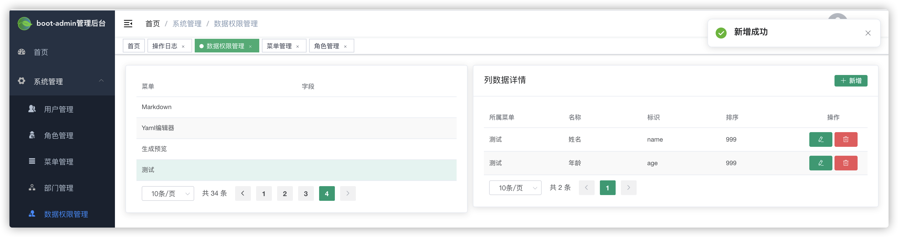

# 数据权限
## 行级别
> 支持操作，SELECT, UPDATE, DELETE
1. 使用注解@DataPermission，在xxMapper类上，配置后台管理系统，**系统管理*/*角色管理*/*数据范围**
2. 原理是通过拦截注解@DataPermission的mapper，根据当前用户的数据范围配置，加入WHERE dept_id、created_by字段条件实现
3. @DataPermission.deptIdInFieldName默认使用dept_id字段
4. @DataPermission.userIdEQFieldName默认使用created_by字段
```JAVA
@DataPermission
public interface StudentMapper extends MyBaseMapper<StudentDO> {}
```

*使用datascope**注意事项***

1. 多个角色重合情况下，看到自己和下级，可用同1部门解决，不会出现自己与所管人不在同一部门场景    
2. 所在机构及以下，只查父子级别

## 列级别
1. 配置后台管理系统，**系统管理/数据权限管理**
2. **系统管理/角色管理**，菜单分配下可勾选表示禁用字段
3. 注解@DataPermissionFieldMethod，"student:list"对应控制器的权限标识
4. 返回类型只支持MyPage、Collection
> 分页
``` JAVA
		@DataPermissionFieldMethod("student:list")
    public MyPage<StudentVO> pageQuery(PageParam page, StudentSortEnum sort, StudentQueryCriteriaDTO query) {
        QueryWrapper queryWrapper = MybatisUtil.assemblyQueryWrapper(query);
        return this.baseMapper.pageQuery(page, null, sort, queryWrapper);
    }
```
> 输出结果

```json
{
  "code": 2001,
  "message": "OK",
  "data": {
    "records": [
      {
        "id": 3,
        "name": "",
        "age": 3,
        "gmtCreate": "2021-09-14 09:22:44",
        "createdBy": "System",
        "course": 105
      }
    ],
    "total": 3,
    "pages": 1,
    "meta": [
      {
        "sort": 999,
        "name": "姓名",
        "code": "name",
        "isAccessible": false
      },
      {
        "sort": 999,
        "name": "年龄",
        "code": "age",
        "isAccessible": true
      }
    ]
  }
}
```


```
<!--表格渲染-->
      <el-table ref="table" v-loading="crud.loading" :data="crud.data" size="small" style="width: 100%;" @selection-change="crud.selectionChangeHandler">
        <el-table-column type="selection" width="55" />
        <el-table-column
          v-for="(item, index) in crud.meta"
          :key="index"
          :prop="item.code"
          :label="item.name">
        </el-table-column>
        <el-table-column v-permission="['admin','student:edit','student:del']" label="操作" width="150px" align="center">
          <template slot-scope="scope">
            <udOperation
              :data="scope.row"
              :permission="permission"
            />
          </template>
        </el-table-column>
      </el-table>
```
> 导出
``` JAVA
    @Log("导出用户")
    @ApiOperation(value = "导出用户", tags = ApiVersion.VERSION_1_0_8)
    @GetMapping(value = "/download", produces = MediaType.APPLICATION_OCTET_STREAM_VALUE)
    @PreAuthorize("@el.check('student:list')")
    public void download(@ApiParam(value = "排序", required = true)
                         @NotNull(message = "排序字段不正确")
                         @RequestParam StudentSortEnum sort,
                         StudentQueryCriteriaDTO criteria) {
        DataPermissionFieldResult dataPermissionFieldResult = studentService.listQueryAll(sort, criteria);
       //downloadExcel方法自行判断哪些字段是否导出
        DataPermissionFieldResult.downloadExcel(dataPermissionFieldResult);
    }

    @DataPermissionFieldMethod("student:list")
    public DataPermissionFieldResult<StudentVO> listQueryAll(StudentSortEnum sort, StudentQueryCriteriaDTO query) {
        QueryWrapper queryWrapper = MybatisUtil.assemblyQueryWrapper(query);
        List<StudentDO> list = this.baseMapper.queryAll(sort, queryWrapper);
        return DataPermissionFieldResult.build(studentMapStruct.toVO(list));
    }
```


## 截图

> 标识列对应VO定义的字段名，private String name;



