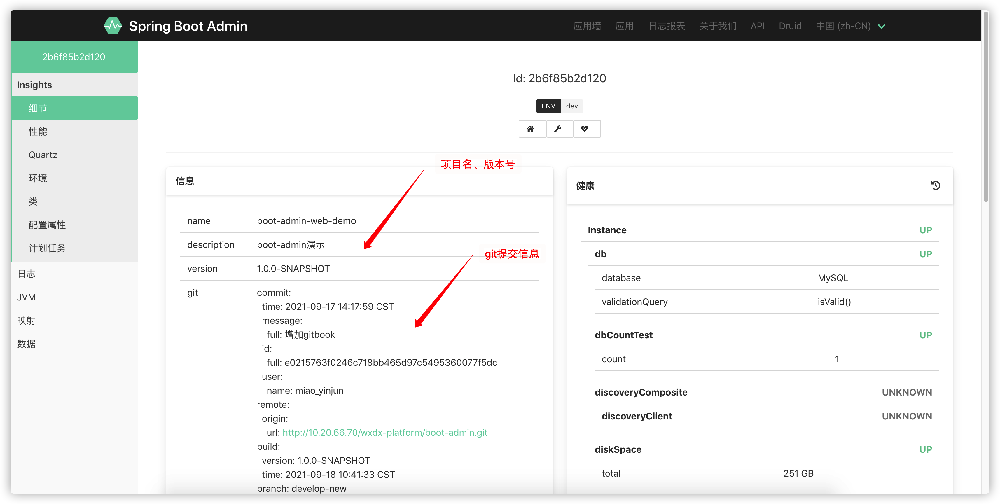
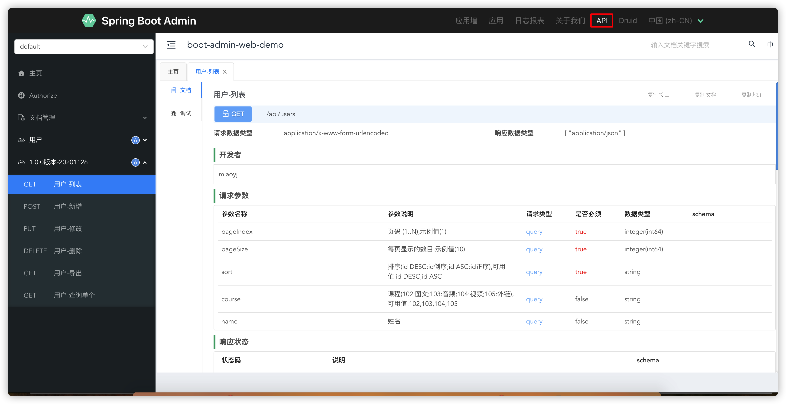
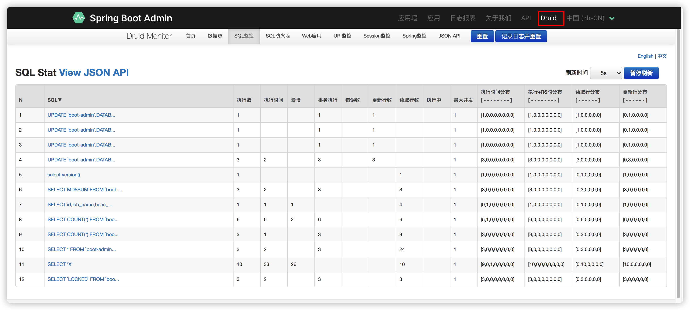

# spring-boot-admin
>当前服务即是**客户端也是服务端**，监控服务运行状态
>
>如需独立spring-boot-admin服务端监控多个服务，可启动boot-admin-sba-server，修改环境变量BOOT_ADMIN_SBA_SERVER_URL为spring-boot-admin服务端的地址即可

1. 访问http://localhost:8801/sba/， 进入实例
2. dev环境无密码，其它环境必须提供密码，配置路径参见【环境变量】

1. 项目信息，GIT最近一次的提交记录

   

2. knife4j接口文档入口

   

3. druid数据库监控入口

   

4. 日志（DEV环境不会产生日志文件，所以不能查看，可切换到其它环境验证日志）

   > 再也不用到服务器上查看日志了

   

5. 其它如环境变量，配置文件等监控可自行摸索

